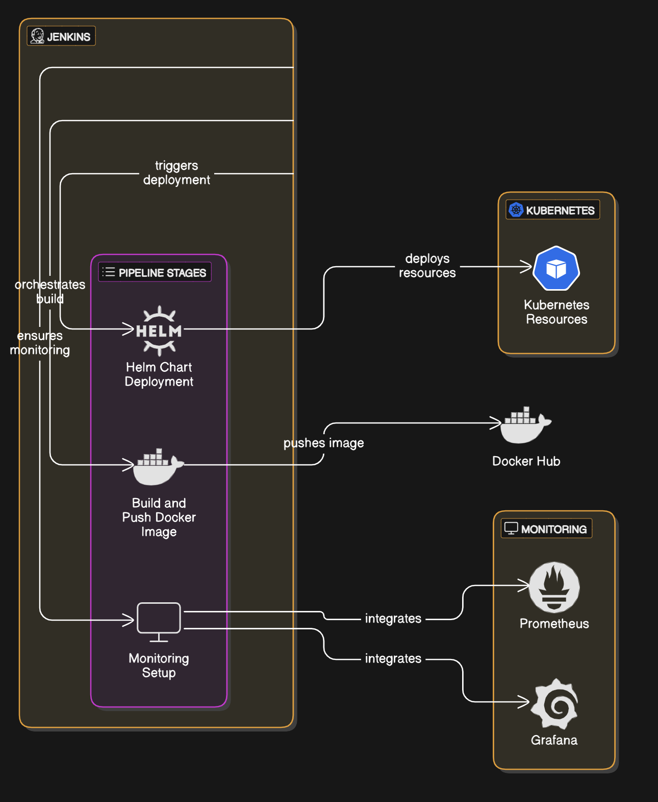

---

# Lightweight Go Application
## Overview

The **Lightweight Go Application** is a simple yet powerful web server designed to be deployed and managed efficiently using Kubernetes and Helm. Built with scalability and observability in mind, this project aims to provide a streamlined solution that integrates containerization, continuous integration, continuous deployment (CI/CD), and monitoring using Prometheus and Grafana.

## Workflow Diagram



## Features

- **Simple Web Server**: A lightweight Go application that runs on port 3000, responding to HTTP requests.
- **Dockerized**: The application is containerized using Docker to ensure portability and easy deployment.
- **Scalable Deployment**: Configurable replica counts ensure the application can be scaled horizontally based on traffic.
- **Helm Integration**: Deploys via Helm, simplifying the deployment process on Kubernetes.
- **Monitoring with Prometheus & Grafana**: Provides out-of-the-box monitoring and visualization using Prometheus and Grafana, enabling better observability.

## Prerequisites

Before proceeding, ensure the following are installed and configured:

- **Kubernetes Cluster**: A Kubernetes environment (e.g., Minikube, Google Kubernetes Engine, etc.) is required.
- **Helm**: Helm must be installed to manage Kubernetes resources and deploy applications using Helm charts.
- **Docker Hub Account**: A Docker Hub account is necessary for building and storing Docker images.

## Installation

Follow these steps to install and deploy the application:

1. Clone the repository:
   ```sh
   git clone https://github.com/your-username/lightweight-go-app.git
   cd lightweight-go-app
   ```

2. Build and push the Docker image to Docker Hub:
   ```sh
   docker build -t your-docker-username/lightweight-go-app .
   docker push your-docker-username/lightweight-go-app
   ```

3. Install the Helm chart:
   ```sh
   helm install lightweight-go-app helm-chart/
   ```

4. Verify deployment:
   ```sh
   kubectl get deployments
   kubectl get pods
   ```

## Configuration

The following configurations can be adjusted via the `values.yaml` file in the `helm-chart/` directory:

- **Replica Count**: Adjust the number of replicas using the `replicaCount` value.
- **Image Repository & Tag**: Modify the image repository and tag using `image.repository` and `image.tag` in `values.yaml`.

## Monitoring and Visualization

To monitor the application, Prometheus and Grafana are deployed using Helm:

1. **Prometheus**: Configured to scrape metrics from the application.
2. **Grafana**: Provides a visualization dashboard for monitoring application metrics.

### Prometheus Helm Chart
```sh
helm upgrade --install prometheus prometheus-community/kube-prometheus-stack --namespace monitoring --create-namespace
```

### Grafana Helm Chart
```sh
helm upgrade --install grafana grafana/grafana --namespace monitoring --set adminPassword=myadminpassword
```

## Jenkins Integration

### Overview

Jenkins automates the build, deployment, and monitoring of the **Lightweight Go Application**. By integrating Jenkins, CI/CD pipelines ensure that Docker images are built, pushed to Docker Hub, and Helm charts are deployed efficiently on Kubernetes.

### Role of Jenkins

1. **Docker Image Build & Push**: Jenkins automates the process of building and pushing Docker images to Docker Hub.
2. **Helm Chart Deployment**: Automates Helm chart deployment for the application, Prometheus, and Grafana on Kubernetes.
3. **Monitoring & Visualization**: Jenkins sets up Prometheus and Grafana for monitoring and visualization.

---
